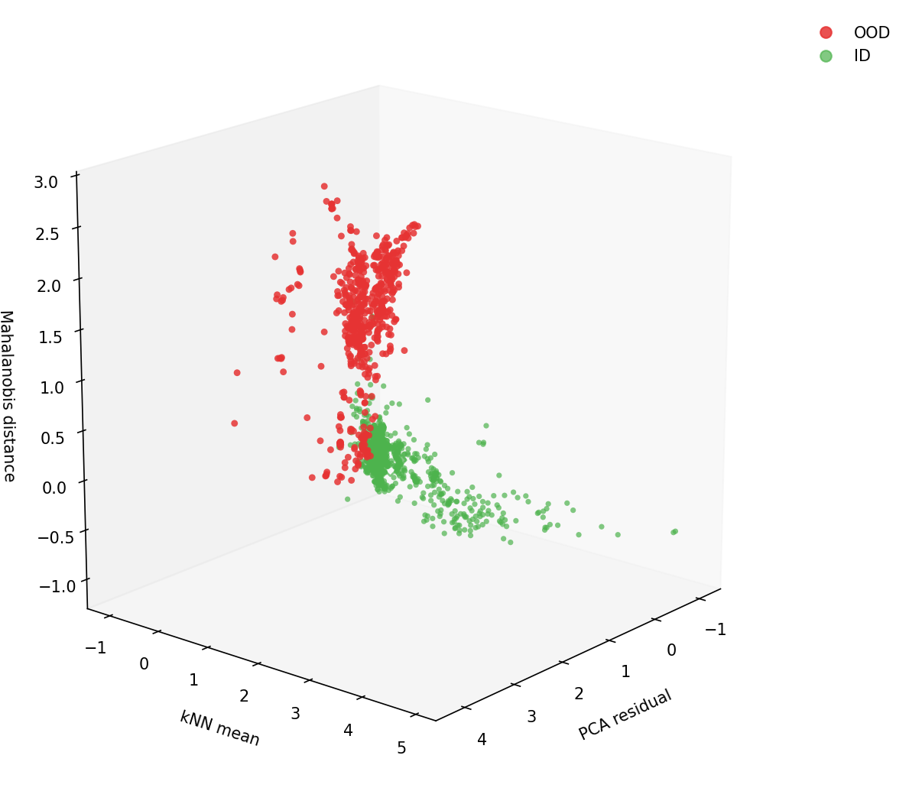
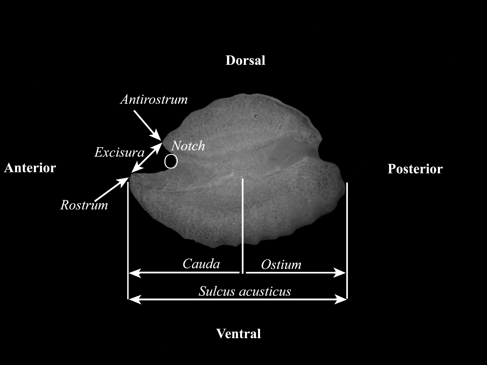

# MORPHID
Morphological Feature Generation for Species Identification

## Baseline (Stage I: Foundational Benchmark)

As a foundational benchmark, we developed finetuned **convolutional neural network (CNN) models** on a curated dataset comprising **30 taxonomically diverse fish otolith classes**.  
The dataset includes representatives such as:  

*Alepocephalus bicolor, Apistus carinatus, Brachypterois serrulata, Chlorophthalmus acutifrons, Choridactylus multibarbus, Coryphaenoides sp., Cubiceps baxteri, Dactyloptena orientalis, Dactyloptena papilio, Dactyloptena tiltoni, Ectreposbastes imus, Grammoplites suppositus, Hoplostethus sp., Lepidotrigla spiloptera, Minous dempsterae, Minous inermis, Minous trachycephalus, Neomerinthe erostris, Parascombrops pellucidus, Platycephalus indicus, Polymixia fusca, Psenopsis sp., Pterygotrigla arabica, Pterygotrigla hemisticta, Pterygotrigla macrorhynchus, Satyrichthys laticeps, Setarches guentheri, Sorsogona tuberculata, Synagrops japonicus,* and *Uranoscopus sp.*  

### Dataset Samples  

Representative otolith images from the dataset: 

|  |  |
|:------------------------------------------:|:------------------------------------------:|
| **Dactyloptena tiltoni**                   | **Pterygotrigla macrorhynchus**                         |

|  |  |
|:------------------------------------------:|:------------------------------------------:|
| **Apistus carinatus**                       | **Chlorophthalmus acutifrons**                    |
---

### Dataset Organization  
- The dataset was stratified into **training**, **validation**, and **test** partitions.  
- All data are systematically arranged in the [`/dataset/`](./cnn/dataset) directory.  

### Training Protocol  
Finetuning was performed using modular code provided in the [`cnn/`](./cnn/) framework.  
A typical training run can be executed as:  

```bash
python -m cnn.scripts.main --mode train --model resnet50 --data_dir ./cnn/dataset
```

### Hyperparameters  
Hyperparameters such as **learning rate**, **batch size**, **optimizer**, and **input resolution** are configurable via [`cnn/scripts/main.py`](./cnn/scripts/main.py).  

The pipeline supports multiple architectures (**ResNet, VGG, DenseNet, EfficientNet**, etc.) for comparative benchmarking.  

---

### Outputs and Reproducibility  

- Trained models are automatically stored in timestamped directories under  
  [`cnn/outputs/models`](./cnn/outputs/models).  

- Ancillary outputs are generated, including:  
  - Grad-CAM visualizations  
  - Metrics (accuracy, precision, recall, F1)  
  - Confusion matrices  
  - Loss, accuracy, precision, and recall curves across epochs  

All plots are saved in the [`plots`](./cnn/outputs/plots) subfolder within the corresponding timestamped output directory.  

## Stage II — OOD Robustness and Generalization  

To assess the **robustness of the baseline CNN models (Stage I)** under **open-set conditions**, we performed **out-of-distribution (OOD) detection**. The implementation uses **softmax confidence scoring** provided in [`cnn/core/ood.py`](./cnn/core/ood.py).  

---

### OOD Detection (based on model confidence)  

The OOD evaluation requires three input directories:  

1. **ID test set directory**  
   Path: [`cnn/dataset/test`](./cnn/dataset/test)  
   - Contains the in-distribution otolith test images.  

2. **OOD root directory**  
   Path: [`cnn/OOD_data`](./cnn/OOD_data)  
   - Contains multiple OOD subsets (e.g., *deepsea*, *shallow marine*, *freshwater*).  

Representative OOD otolith images from the dataset: 

|  |  |
|:------------------------------------------:|:------------------------------------------:|
| **Amphiprion clarki**                   | **Lutjanus malabaricus**                         |

|  |  |
|:------------------------------------------:|:------------------------------------------:|
| **Nemipterus sp.**                       | **Deep sea species (Unknown)**                    |
---

3. **Checkpoint directory**  
   Path: [`cnn/outputs/models`](./cnn/outputs/models)  
   - Stores the finetuned CNN model weights.  


Example command:  

```bash
python cnn/scripts/ood.py \
  --id-dir <path_to_test_set> \
  --ood-root <path_to_ood_subsets> \
  --ckpt-dir <path_to_model_checkpoint>
```
#### OOD Detection Results  

All metrics and reports are saved in the corresponding timestamped output folder:  
[`cnn/outputs/<timestamp>/models/`](./cnn/outputs/models/)  

The outputs include:  
- 📊 **Confidence histograms** (ID vs OOD distributions)  
- 📈 **ROC and PR curves** for OOD detection performance  
- 🧮 **Evaluation metrics**: AUROC, AUPR (In/Out), FPR  
- 📂 **Per-subset statistics** for each OOD category (e.g., *deepsea*, *shallow marine*, *freshwater*)  
 
<!-- ## Stage II — OOD Robustness and Generalization  

In addition to **confidence-based OOD detection**, we implemented **distance-based detection** methods using CNN embedding features.  

--- -->

### OOD Detection (based on Embedding) 

In addition to **confidence-based OOD detection**, we implemented **distance-based detection** methods using CNN embedding features. 

1. **Feature extraction**  
   - Embeddings are extracted from the penultimate CNN layer.  
   - Scripts: [`cnn/scripts/ood_distance.py`](./cnn/scripts/ood_distance.py)  

2. **Distance-based OOD metrics**  
   The following metrics are computed for each OOD sample:  
   - **Mahalanobis minimum distance** (`ood_maha_min`)  
   - **PCA residuals** (`ood_residual`)  
   - **k-NN mean distance** (`ood_knn_mean`)  

   All metrics are aggregated into a CSV file:  [`cnn/outputs/<timestamp>/models/embedding_metrics_id_ood.csv`](./cnn/outputs/<timestamp>/models/embedding_metrics_id_ood.csv)  

3. **Metric computation and visualization**  
- Script: [`cnn/scripts/embedding_ood_cal.py`](./cnn/scripts/embedding_ood_cal.py)  
- Generates numerical results and comparison plots.  

4. **Score distribution plots**  
- Script: [`cnn/scripts/ood_score_plot.py`](./cnn/scripts/ood_score_plot.py)  
- Visualizes OOD scores across ID vs OOD samples.  

5. **Embedding visualization**  
- 2D/3D visualizations of feature embeddings.  
- Scripts:  
  - [`cnn/scripts/embeddings_visualisation.py`](./cnn/scripts/embeddings_visualisation.py)  saved in [`cnn/outputs/<timestamp>/plots/embeddings_visualisation.png`](./cnn/outputs/<timestamp>/plots/embeddings_visualisation.png)
  - [`cnn/scripts/embedding_3d.py`](./cnn/scripts/embedding_3d.py) saved in [`cnn/outputs/<timestamp>/plots/ood_id_separation_3d.png`](./cnn/outputs/<timestamp>/plots/ood_id_separation_3d.png)  

---

#### Outputs  

- `embedding_metrics_id_ood.csv` → Numerical summary of OOD distances.   
- Embedding distributions plot (ID vs OOD)  
- Score distribution curves   

Example outputs (distance-based OOD scoring):  

|  |  |
|:------------------------------------------:|:------------------------------------------:|
| **ID-OOD separation (3D)**                   | **t-sne Embedding**                         | 

---

📊 **Interpretation**:  
- Distance-based OOD methods (Mahalanobis, PCA residual, k-NN) provide complementary information to raw confidence scores.  
- Visualizations highlight clearer separation between **ID** and **OOD embeddings**, but robustness varies by subset (deepsea, shallow marine, freshwater).  

## Stage III — Morphological Captioning (VLMs)  

In this stage, we extend beyond classification and OOD detection by generating **morphological descriptions of otoliths in a taxonomic framework** using **vision–language models (VLMs)**.  
Morphological captioning provides **explainable taxonomic insights**, bridging the gap between visual features and species-level identification. This stage integrates **image features, structured annotations, and text outputs**, moving towards interpretable and human-aligned AI for marine taxonomy.  

The descriptions focus on diagnostic features critical for species identification:  

- **Sulcus acusticus**  
- **Ostium**  
- **Cauda**  
- **Posterior region**  
- **Anterior region**  

The VLMs not only describe these regions but also predict the **fish species** to which the otolith belongs.  

---

### Morphological Annotation  

An example otolith image with annotated regions is shown below:  

<p align="center">
  
</p>  

---

### Data Preparation  

- Input data are stored in the [`Captioning/text_data/`](./Captioning/text_data) folder.  
- Each sample (train, test, OOD) has a corresponding **feature file** describing the morphological regions.  

**Initial format:**  
- Provided as `.xlsx` spreadsheets.  

**Preprocessing:**  
- Run [`notebooks/stats.ipynb`](./notebooks/stats.ipynb) to clean and standardize the feature files.  
  - Align feature rows with images in the dataset folder.  
  - Remove missing files and redundant entries.  
  - Export a **modified `.csv` file** containing the cleaned feature descriptions.  

**Final format:**  
- Cleaned `.csv` files are used as input for VLM training and evaluation.  

---

### Outputs  

- **Generated captions** describing the morphology of otoliths.  
- **Species predictions** linked to morphological descriptions.  
- **Feature-aligned CSVs** for reproducibility of experiments.  

### Example (Ground Truth)  

<p align="center">
  
</p>  

<blockquote>
<b>Type:</b> Sagittal  
<b>Side:</b> Right otolith  
<b>Shape:</b> Fusiform; sinuate to entire dorsal and entire ventral margins  
<b>Sulcus acusticus:</b> Heterosulcoid, ostial, median  
<b>Ostium:</b> Tubular; longer than cauda  
<b>Cauda:</b> Tubular, straight  
<b>Anterior region:</b> Angled; rostrum defined, blunt; antirostrum poorly defined or blunt; excisura moderately wide with acute shallow notch  
</blockquote>


---

###  VLM Finetuning (Gemma-3) for Morphological Captioning & Species Prediction

Finetune **Gemma-3 Vision** to generate **taxonomic morphological descriptions** and the **species prediction** for each otolith image.  
Reference implementation: Gemma docs — *Hugging Face Vision Finetune with QLoRA*  
👉 https://ai.google.dev/gemma/docs/core/huggingface_vision_finetune_qlora

### Code & Prompts
- Finetuning script: [`./Captioning/gemma/train.py`](./Captioning/gemma/train.py)  
- Prompt templates:
  - System prompts: [`./Captioning/prompts/system/`](./Captioning/prompts/system/)
  - User prompts:   [`./Captioning/prompts/user/`](./Captioning/prompts/user/)


### VLM Finetuning (LLaMA-3.2 Vision, Unsloth)

In parallel to Gemma-3, we finetune **LLaMA-3.2 Vision** using **Unsloth** for
(1) **morphological captioning** of otoliths and
(2) **species prediction**.

**References (method guides):**
- DataCamp tutorial: https://www.datacamp.com/tutorial/fine-tuning-llama-3-2-vision
- Kaggle notebook (Unsloth): https://www.kaggle.com/code/danielhanchen/llama-3-2-vision-finetuning-unsloth-kaggle

### Code & Layout
- Finetuning script: [`Captioning/llama/train_llama.py`](./Captioning/llama/train_llama.py)  
- Evaluation script: [`Captioning/llama/test_data.py`](./Captioning/llama/test_data.py)  
- Prompts (reuse taxonomy prompts if desired): [`Captioning/prompts/`](./Captioning/prompts/)


**Target features in captions:** *sulcus acusticus, ostium, cauda, posterior region, anterior region*  
**Output:** structured caption + species label.

---

### Outputs (Gemma-3 and LLaMA-3.2 Vision)
Outputs of the VLMs on the test sets using dedicated test scripts.  
Both scripts emit CSVs with *at least* the following columns:

- `Image (image_path)`
- `actual_label`          (ground-truth species)
- `predicted_label`       (model species prediction)
- `generated_caption`     (model morphological description)

---

#### Gemma-3 Vision

- **Test script:** [`Captioning/gemma/test_data.py`](./Captioning/gemma/test_data.py)  
- **Default output CSV:** `otolith_test_results_progress.csv` in `Captioning/Outputs/`
- **Merge ground truth with generated features script:** [`Captioning/gemma/merge_df.py`](./Captioning/gemma/merge_df.py)
- **Final output CSV:** `paired_captions_minimal.csv` in `Captioning/Outputs/`

#### LLaMA-3.2 Vision

- **Test script:** [`Captioning/llama/test_llama.py`](./Captioning/llama/test_llama.py)  
- **Default output CSV:** `llama_test_results_progress.csv` in `Captioning/Outputs/`
- **Merge ground truth with generated features script:** [`Captioning/gemma/merge_df.py`](./Captioning/gemma/merge_df.py)
- **Final output CSV:** `llama_paired_captions_minimal.csv` in `Captioning/Outputs/`
- **Post-filter script (to clean the results generated by finetuned LLaMA-3.2 Vision):** [`Captioning/llama/filter_gen.py`](./Captioning/llama/filter_gen.py)
- **Filtered output CSV:** `output_filtered.csv` in `Captioning/Outputs/`

---
### Evaluation & Outputs (Gemma-3 and LLaMA-3.2 Vision)

After postprocessing and filtering, the final outputs of the VLMs on the test sets have the following columns:

- `Image(image_path)`
- `actual_label`          (ground-truth species)
- `predicted_label`       (model species prediction)
- `generated_caption`     (model morphological description)
- `Description`           (ground-truth morphological description)

---

#### 1. Automatic morphological feature scoring

- **Script:** [`Captioning/gemma/eval_one.py`](./Captioning/gemma/eval_one.py)  
- **Output CSV:** `caption_scores_all.csv` in `Captioning/Outputs/` for llama it is `llama_caption_scores_all.csv`

This computes standard automatic metrics such as:  
- BLEU-1/2/3/4  
- ROUGE-L  

#### 2. Classification Metrics

- **Script:** [`Captioning/gemma/class_metrics.py`](./Captioning/gemma/class_metrics.py)  
- **Outputs:** 
  - Text report: precision, recall, F1-score per species
  - Confusion matrix (saved as PNG) in `Captioning/Outputs/`

#### 3. Character wise evaluation

- To get the variations in each feature, and the hallucinations we used the script **Script:** [`Captioning/gemma/ostium_variations.py`](./Captioning/gemma/ostium_variations.py)  for a feature "ostium"
  - **Output:** `ostium_confusion_matrix.png` in `Captioning/llama/plots/`
- To get the CER for a feature "sulcus acusticus" we used the script **Script:** [`Captioning/gemma/sulcus_cer.py`](./Captioning/gemma/sulcus_cer.py)  
  - **Output:** Mean CER, Median CER of each feature.

#### 4. OOD Metrics

- **Script:** [`Captioning/gemma/ood_metrics.py`](./Captioning/gemma/ood_metrics.py)  
-**Plot:** [`Captioning/gemma/ood_metric_plot.py`](./Captioning/gemma/ood_metric_plot.py) 

---
## Repository Structure  

The repository is organized into modular components corresponding to each stage of the MORPHID pipeline

- `cnn/`: Stage I — Baseline CNNs for otolith classification and OOD detection.  
  - `core/`: Models, training loops, evaluation functions, OOD detection.  
  - `scripts/`: Entry points (`main.py`, `gradcam.py`, `ood_eval.py`).  
  - `outputs/`: Auto-generated models, plots, metrics (ignored in git).  

- `Captioning/`: Stage III — Vision-Language Models (VLMs) for morphological captioning and species prediction.  
  - `gemma/`: Gemma-3 Vision finetuning (`train.py`) and testing (`test_data.py`).  
  - `llama/`: LLaMA-3.2 Vision finetuning (`train_llama.py`), testing (`test_llama.py`), filtering (`filter_gen.py`).  
  - `prompts/`: System and user prompts for taxonomy-aware generation.  
  - `text_data/`: Cleaned `.csv` feature files (preprocessed from raw `.xlsx`).  

- `otolith/`: Evaluation scripts.  
  - `eval_one.py`: Automatic caption scoring (BLEU, ROUGE, METEOR).  
  - `llm_eval.py`: GPT-based scoring for morphological correctness.  
  - `class_metrics.py`: Species classification metrics & confusion matrix.  

- `notebooks/`: Data cleaning and exploratory analysis (Jupyter notebooks).  
- `assets/`: Figures and sample otolith images for the README (PNG/JPG only).  
- `.gitignore`: Ignore large files, datasets, and auto-generated outputs.  
- `requirements.txt`: Python dependencies for reproducibility.  
- `README.md`: Documentation (this file).  
- `LICENSE`: License for code/data use.  

---
## Contributing  

We welcome contributions to enhance **MORPHID**. To contribute:  

1. **Fork** the repository.  
2. **Create a new branch**:  
   ```bash
   git checkout -b feature-branch
3. **Make your changes** and commit them.  
4. **Commit your changes**:  
   ```bash
   git add .
   git commit -m "Add feature" 
   ```
5. **Push** your changes to your fork. 
   ```bash
   git push origin feature-branch
   ```
6. **Open a pull request** and describe your changes.  

## Contact
For questions or issues, please open an issue in this repository or contact the maintainers

#### Name: Reshma B, Vysakh Sukumaran, Davood Nihal
#### Email: reshmababuraj89@gmail.com, sreemanvysakh@gmail.com, davoodnihal123@gmail.com

---